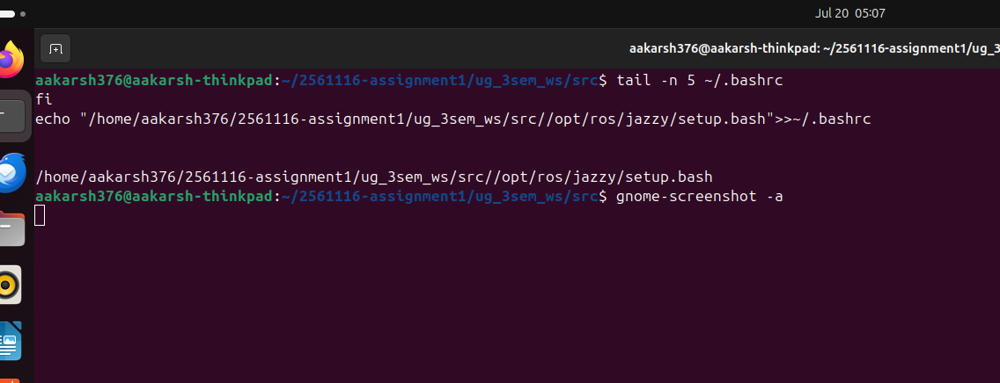
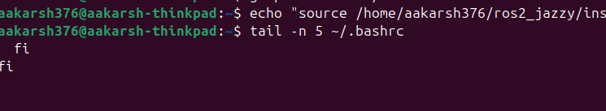

# Assignment 1: The ROS 2 Developer Foundation

**Student Name:**
**Roll Number / Batch:**

## 1. Base Workspace vs. Overlay Workspace

The base workspace is the core ROS 2 Jazzy installation — in my case, built from source at ~/ros2_jazzy/install/setup.bash. It contains all the standard ROS 2 packages, tools, and libraries (e.g. rclpy, rclcpp, ros2cli, message types like std_msgs) that ship with the distribution. This is sourced first, in ~/.bashrc, so it's available in every terminal session by default.

The overlay workspace (ug_3sem_ws) is a separate, local workspace containing my own custom packages (robot_info_py and robot_info_cpp). When I source ug_3sem_ws/install/setup.bash after the base workspace, ROS 2 layers my packages "on top of" the base installation — hence "overlay." This means:

Both the base packages and my custom packages are available in the same terminal session simultaneously.
If a package with the same name exists in both the base and the overlay, ROS 2 prioritizes the overlay version (this is how developers can safely test modified or newer versions of existing packages without touching the core installation).
The overlay depends on the base being sourced first — it doesn't duplicate or replace the base, it extends it.
## 2. Purpose of `src` and `install` Directories

src/ is where all source code lives — this is the only folder I actually write and edit by hand. It contains my packages (robot_info_py and robot_info_cpp) in their raw, human-readable form: Python scripts, package.xml metadata, CMakeLists.txt, setup.py, and so on. This is the "source of truth" for the project — everything else is generated from it.

install/ is generated automatically by running colcon build. It contains the compiled/prepared version of each package that ROS 2 actually executes — for the Python package, this means the registered executables (like hello_script), Python modules copied or symlinked into place, and setup files (setup.bash) that must be sourced to make the packages available via ros2 run. For the C++ package, it contains the compiled binaries. Nothing in install/ is written by hand; it is entirely derived from src/.

Why install/ (and build/, log/) are excluded from Git:

They are auto-generated, machine- and path-specific artifacts, not source code — committing them adds no real value and only bloats the repository.
They can always be recreated by anyone who clones src/ and runs colcon build themselves, so there's nothing lost by excluding them.
They often contain absolute paths and environment-specific details (tied to my machine), which can break or behave unexpectedly if copied directly to someone else's system.
This mirrors standard practice in software engineering generally: commit source, not build output (similar to not committing node_modules/ or .class/.o files in other ecosystems).

## 3. Verification Screenshot






/


---

## Repository Structure

```
ug_3sem_ws/
└── src/
    ├── robot_info_py/      # ament_python package
    └── robot_info_cpp/     # ament_cmake package
```

Do **not** commit `build/`, `install/`, or `log/` — these are excluded via `.gitignore`.
